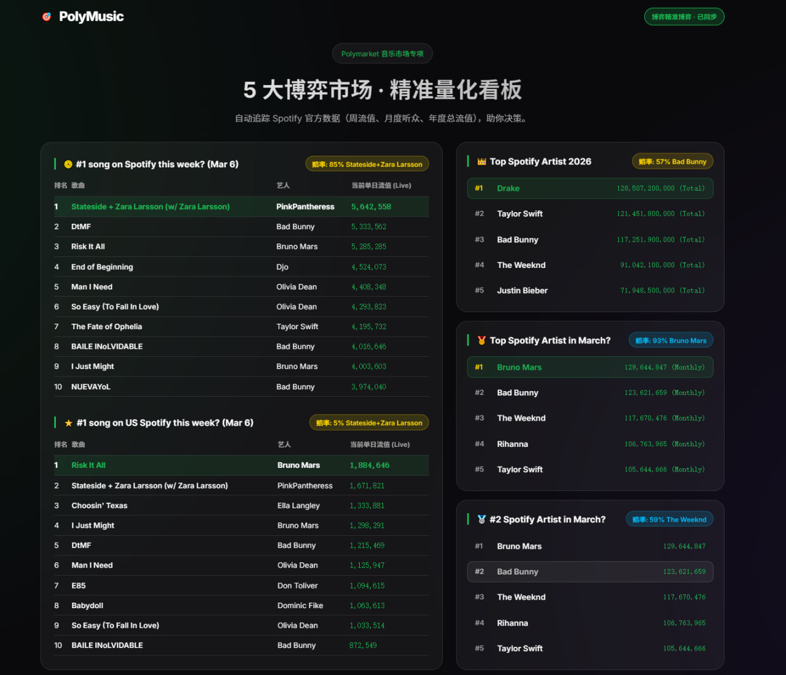

# PolyMusic 🎵

一个专为 Polymarket 预测市场量身定制的音乐数据量化追踪看板。



## 为什么选择 PolyMusic？

Polymarket 的音乐博弈市场在“数据结算源”上有着极其具体和复杂的规定。为了弥补滞后数据和盘口赔率之间的认知差，PolyMusic 对赌盘做了 1:1 的数据结构还原：

1. **周榜单曲市场（Global #1 / US #1）**：官方使用 `open.spotify.com` 结算。由于玩家赌的是本周最终生成的榜单结果，PolyMusic 不再抓取滞后的过去“周报”，而是直接解析 Spotify 官方前哨站（`charts.spotify.com`）注入的 Next.js API 数据（`__NEXT_DATA__`），为你拉取 **当前最实时的单日流值 (Live)**，从而让你提前预判该周冠军的归属。
2. **月度及年度艺人市场（Top Artist in March / Top Artist 2026）**：官方明文规定使用外部辅助网站 Kworb（如 `kworb.net/spotify/listeners.html`）作为唯一结算标准。PolyMusic 通过“混合数据抓取器”，专门为这部分艺人指标自动跌落回 Kworb 的网页解析抓取，确保你看到的量级与官方要求的一丝不差。

## 🎯 追踪的主要 Polymarket 市场

系统目前自动同步和展示以下 5 大热点市场：

- #1 song on Spotify this week? (Global 全球)
- #1 song on US Spotify this week? (US 美国)
- Top Spotify Artist in March?
- #2 Spotify Artist in March?
- Top Spotify Artist 2026

## 🚀 一键部署

为了方便云服务器（VPS）玩家快速搭建个人情报站，我们提供了一键 Docker 自动化脚本，它会包办清空旧兼容数据、构建服务及后台常驻的所有繁琐环节。

### 前置要求

- 你的服务器安装了 Docker 以及 Docker Compose
- 安装了 Git

### 服务端极速拉起 (Linux / VPS)

```bash
git clone https://github.com/yangyuan-zhen/PolyMusic.git
cd PolyMusic

# 赋予执行权限并执行一键部署脚本
chmod +x deploy.sh
./deploy.sh
```

执行完毕后，爬虫容器与 Web 容器将自动在后端启动，并在检测到有新一轮更新时覆盖 SQLite 脏数据。

### 访问数据看板

通过浏览器访问 `http://<你的服务器IP>:8001`（如果是不含 Docker 映射的本地环境则为端口 `8000`）。
看板将在后台默默保持着 6 小时一次的高频同步速度，保证你的决策数据随时保持竞争力。

## 🛠 技术架构与生态

- **爬虫端**: Python 3.10+, BeautifulSoup4, Requests
- **数据存储**: SQLite3
- **前端 Web 展示**: FastAPI, Jinja2 Templates (搭配精美的暗黑玻璃质感 CSS 及现代化微动效互动)
- **部署管理**: Docker & Docker Compose

## 本地开发指南

如果你想做二次开发或是不想使用 Docker：

```bash
# 1. 安装项目依赖
pip install -r requirements.txt

# 2. 启动 Web 看板端
uvicorn web.main:app --host 0.0.0.0 --port 8000 --reload

# 3. 另开一个终端窗口跑数据抓取挂机脚本：
python bot_listener.py
```
